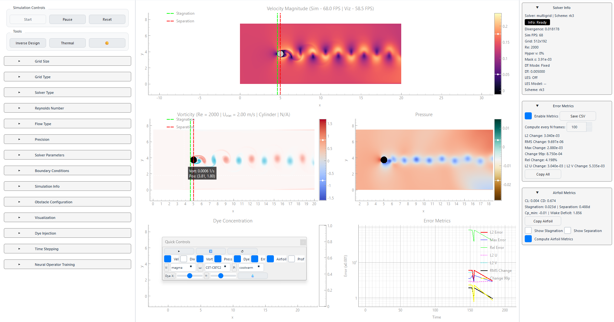

# AeroJAX

*A real-time, JAX-native CFD framework for interactive flow research, control, and inverse design.*

<div align="center">

##
If AeroJAX is useful to you, consider leaving a star ⭐
##

[]
[](https://doi.org/10.5281/zenodo.19857238)
[]
[]


</div>


## What makes AeroJAX different?
Most CFD software is batch‑oriented: simulations are configured, run to completion, and analysed afterwards. Changing anything means starting over.

AeroJAX is an interactive CFD framework in which solver parameters, boundary conditions, and immersed geometries can be modified during runtime - without restarting the simulation.

- Draw an obstacle with your mouse - the solver injects it on the next timestep using Brinkman penalisation.
- Drag a NACA airfoil across the domain with a slider and watch the wake evolve in real time.
- Pressure solvers (FFT, Conjugate Gradient, Multigrid, or Neural Operator) can be swapped mid-simulation without restarting.
- Toggle LES models (Smagorinsky / dynamic Smagorinsky) on the fly.
- Inject dye at any point and watch it advect.
- Record video or export frames with one click.
- Inspect and replay solver internals step-by-step using the Trace Viewer (no black-box timesteps).

AeroJAX is built on JAX, making each solver step end-to-end differentiable. You can run gradient‑based inverse design (optimise an airfoil shape to minimise drag) without writing a separate adjoint solver.

The framework is CPU‑optimised for real-time performance. Typical performance reaches ~297 FPS at 512×96 on a laptop CPU. No GPU is required for smaller grids.

## Quick start

```bash
git clone https://github.com/arriemeijer-creator/AeroJAX
cd AeroJAX
pip install -r requirements.txt
python main.py
```
### Requirements

Python 3.11+

> Optional NVIDIA Hardware Acceleration
> ```bash
>python -m pip install --upgrade "jax[cuda12]" #For CUDA 12
>python -m pip install --upgrade "jax[cuda13]" #For CUDA 13
>```
## The GUI

<div align="center">



</div>

### First run tips

- Start with 512×96 grid for real‑time performance.
- Try the default initialized von Kármán with NACA 0012 airfoil at 10° AoA.
- Enable "Adaptive dt" to see the PID controller in action.

## What you can control

The UI is organised into collapsible panels. Everything below can be changed mid‑simulation unless noted.

### Floating Quick-Control Bar
A semi-transparent overlay provides instant access to the most frequent interactions without needing to navigate the sidebar:

- **Playback:** Instant Start (▶), Pause (⏸), and Reset (↺).
- **Layer Toggles:** Hot-swap visibility for Velocity, Divergence, Vorticity, Pressure, and Dye layers.
- **Diagnostics Toggles:** One-click activation of Error Metrics, Airfoil Metrics, and Profiling Overlays.
- **Live Colormaps:** Change colormaps for V, ω, and P on the fly to highlight different physical features.
- **Precision Dye Injection:** Dual-slider (X, Y) control for real-time scalar tracer injection.

### Simulation control (top bar)

- Start / Pause / Reset
- Inverse Design - experimental module for adjoint‑based shape optimisation
- Thermal - placeholder for future heat transfer (Boussinesq approximation buoyancy flow is already conceptually implemented).
- Theme toggle - light / dark mode

### Grid & solver

| Panel | What you can change |
|-------|---------------------|
| Grid Size | Nx, Ny (64‑4096 / 32‑2048) - requires sim restart |
| Grid Type | Collocated or MAC (staggered) - sim restart |
| Solver Type | Navier‑Stokes or Lattice Boltzmann (D2Q9/D2Q7) - enables direct solver-to-solver comparison under identical flow conditions - sim restart required |
| Precision | float32 / float64 - GUI reload |

### Flow parameters

| Panel | What you can change |
|-------|---------------------|
| Reynolds Number | Lock any two of U_inf, ν, Re - the third auto‑updates. Apply live. |
| Flow Type | von Kármán, Lid-Driven Cavity Flow, Taylor‑Green Vortex - sim restart. |

### Solver parameters

| Control | What it does |
|---------|--------------|
| Multigrid V‑cycles | Number of multigrid cycles (1‑10). Apply live. |
| Hyper ν | Hyperviscosity (0‑0.05) - improves stability for under‑resolved turbulence. |
| Fast Mode (RK2) | Switches from RK3 to RK2 - faster but less accurate. |
| LES | Enable, choose Smagorinsky or dynamic Smagorinsky. Apply live. |
| Pressure Solver | Multigrid, CG (iteration-dependent; slower for poorly conditioned systems), FFT (for periodic BCs like LDC), Jacobi - requires sim restart. |

### Boundary conditions

| Control | What it does |
|---------|--------------|
| Slip Walls | Toggle between no‑slip and free‑slip on domain walls. |
| Mask ε | Brinkman penalisation sharpness (0.01‑1.0). Higher = sharper but stiffer. |

### Obstacles (all live)

- Type: Cylinder (single), NACA airfoil (4‑/5‑digit), Cow (arbitrary complex geometry demo), Three‑cylinder array.
- NACA: Choose from selected 4‑digit and 5‑digit series. Set chord length, angle of attack (AoA) with slider/spinbox.
- Cylinder: Radius (live preview as you input).
- Cylinder array: Diameter, spacing between centres.
- Position: X and Y sliders - drag the obstacle across the domain live.
- Draw custom obstacle: Click and draw a shape with your mouse in the PyGame drawing window. The SDF generator injects it immediately.

### Time stepping

- dt (fixed) - apply live.
- Adaptive dt - PID controller based on divergence error with CFL monitoring (experimental).

### Visualisation

| Control | What it does |
|---------|--------------|
| Frame skip | Render every N‑th solver frame - improves UI responsiveness. |
| Target FPS | Limits visualisation framerate to save CPU. |
| Show ... | Toggle velocity, vorticity, pressure, dye, particle mode (computationally expensive due to particle advection), SDF mask, streamlines, quivers - all live. |
| Log / Spatial / Adaptive | Colour scale modes. Adaptive auto‑adjusts range to current data. |
| Smooth | Upscales low‑res fields for cleaner display 1x (default) to 10x. Note: this does NOT enhance physics - it uses bilinear interpolation to increase visual fidelity. |
| Colormaps | Separate dropdowns for velocity, vorticity, pressure. Many CET and PAL options. |
| Auto‑scale | One‑click rescaling for each field or all at once. |

### Dye injection

- X / Y position (spinbox or sliders)
- Amount (0‑100%)
- Inject dye - adds a scalar tracer that advects with the flow.

### Diagnostics & metrics

| Panel | What you get |
|-------|--------------|
| Simulation Info | Solver status, simulation time, dt, RMS divergence, Sim FPS, Vis FPS. |
| Error Metrics | L2 change, RMS change, max change, 99th percentile change, relative change, component L2 changes. Enable/disable to save performance. Save all history to CSV. |
| Airfoil Metrics | CL, CD, Strouhal number, stagnation point (in chord fractions), separation point, Cp_min, wake deficit. Toggle on/off. Markers overlay on visualisation. Copy all metrics to clipboard. |

## Wake-based signal tracking (real-time physics extraction)

AeroJAX now supports signal-based flow diagnostics as an alternative to explicit structure tracking.

Instead of identifying and tracking vortices, the solver extracts flow physics directly from field signals:

- Sample vertical velocity downstream of bluff bodies
- Detect wake center via zero-crossing in the velocity field
- Construct a time series of wake oscillation
- Apply FFT to extract dominant frequency → Strouhal number

This approach is significantly more stable than vortex identification and tracking, especially in transitional and noisy regimes.

It reflects a broader shift in AeroJAX:

- Not tracking structures explicitly
- Tracking the signals they generate

This enables robust, real-time extraction of flow characteristics without relying on fragile feature detection.

This approach is particularly well-suited for real-time and differentiable workflows.

## Solver Trace Viewer (step-by-step numerical inspection)

AeroJAX now includes a fully decoupled solver trace viewer for inspecting the numerical pipeline at each timestep.

This is not a visualization layer. It reconstructs and exposes the solver itself.

### What it enables

- Step-by-step traversal of simulation timesteps

- Full decomposition of the solver pipeline:

  1. Advection-Diffusion
  2. Divergence computation
  3. Pressure solve
  4. Velocity correction
  5. State update

- Inspection of intermediate reconstructed fields (u*, divergence, etc.)

- Subdomain-level numerical inspection (cell-by-cell values)

- Live metrics (CFL, Reynolds number, extrema)

- LaTeX-rendered equations for each step

### Architecture

The viewer is strictly decoupled from the solver:

- Solver writes snapshots during runtime
- Trace viewer reads snapshots only
- No runtime coupling, no performance impact

This enables:

- Deterministic replay
- Deep debugging of numerical behaviour
- Post-run analysis without rerunning simulations

### Why this matters

Most CFD tools treat the solver as a black box.

AeroJAX exposes the solver as an inspectable pipeline.

This aligns with the broader goal:

- Making CFD not just interactive
- But interrogatable at the numerical level

## Neural Operator training (experimental)

- Generate dataset: Run simulation for N steps, save chosen fields (u, v, p, mask, divergence) to .npz.
- Select operator: Choose from any .py file in neural_operators/.
- Architecture: Linear, NonLinear, Advanced (FNO‑like).
- Train: Set epochs, learning rate, batch size, cancel anytime. Progress bar.
- Load trained model: Replace the pressure solver with a neural operator directly inside the simulation loop.

## Export & recording

- Export Frame - save current visualisation as PNG.
- Record - toggle video recording (saves to disk).
- Save State - not yet implemented.

## Numerical methods & Solver details

- Navier‑Stokes (incompressible) finite‑difference solver on collocated or MAC grid.
- Lattice Boltzmann (D2Q9 / D2Q7) with BGK or MRT collision (low-Mach regime).
- Advection: RK3, RK2, multiple specialised schemes.
- Pressure projection: FFT (periodic), Conjugate Gradient, Multigrid (V‑cycle).
- Turbulence: Smagorinsky & dynamic Smagorinsky LES.
- Immersed boundaries: Brinkman penalisation with smooth Heaviside mask.
- Differentiability: Every step is JAX‑native. Use jax.grad to optimise shapes and controls.  This enables gradient-based inverse design and future differentiable control workflows.
- Performance: Decoupled solver / render / metrics threads with shared‑memory zero‑copy buffers. CPU‑optimised - ~297 FPS (512×96) on a laptop CPU.
- Live parameter updates: Redux‑style state management. The solver checks for changes each timestep and only re-compiles when necessary.

## Performance benchmarks (CPU)

*Benchmarks include full solver stepping and rendering.*

| Grid resolution | Solver + rendering | With full diagnostics |
|-----------------|-------------------|----------------------|
| 512 × 96 | ~297 FPS | ~170 FPS |
| 1024 × 192 | ~131 FPS | ~91 FPS |
| 2048 × 384 | ~37 FPS | ~31 FPS |

## Limitations

- 2D only - designed for rapid prototyping and neural operator research.
- Force coefficients (CL, CD) are trend-accurate but not quantitatively reliable - Brinkman penalisation prevents accurate pressure integration.
- Moderate Reynolds numbers - best for Re < 10,000 (laminar to early turbulent).
- CPU‑focused - GPU execution is supported, but the current architecture is tuned for workstations without dedicated GPUs.
- LBM operates in the low-Mach regime; accuracy degrades if this constraint is violated.

## License

LGPL v3.0 - you can use it in proprietary software as long as you release modifications to the library itself.

## Author

Arno Meijer - Mechanical Engineer | CFD-ML Systems Developer
